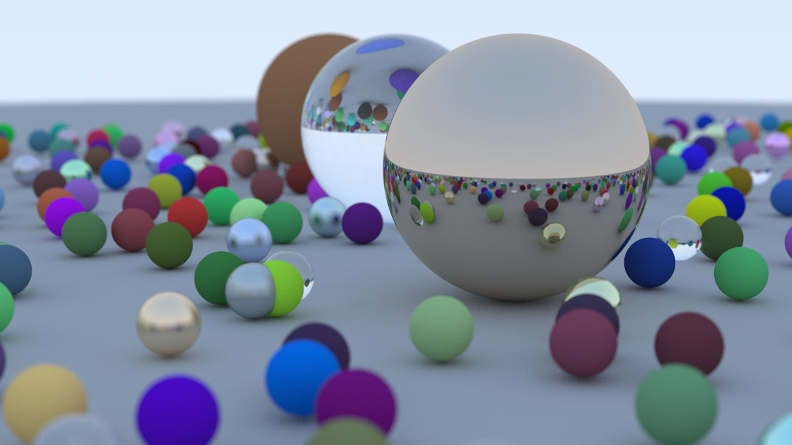

# Ray Tracing in One Weekend

This is my personal implementation of Peter Shirley’s [Ray Tracing in One Weekend](https://raytracing.github.io/books/RayTracingInOneWeekend.html) tutorial. It's a basic ray tracer written in C++ that renders simple 3D scenes from scratch.

## Features

* Ray-sphere intersection
* Diffuse (Lambertian) and metal materials
* Antialiasing with multiple samples per pixel
* Gamma correction
* Random scene generation
* Outputs `.ppm` images

## Example Output



## How to Build & Run

### Requirements

* C++17
* CMake 3.15 or newer

### Build

```bash
git clone https://github.com/therealfiish/raytracer.git
cd raytracer
cmake -B build -DCMAKE_BUILD_TYPE=Release
cmake --build build
```

### Run

```bash
./build/untitled > image.ppm
```

To convert the output to PNG:

```bash
convert image.ppm image.png
```

## Reference

Based on [Ray Tracing in One Weekend](https://raytracing.github.io/books/RayTracingInOneWeekend.html) by Peter Shirley.
